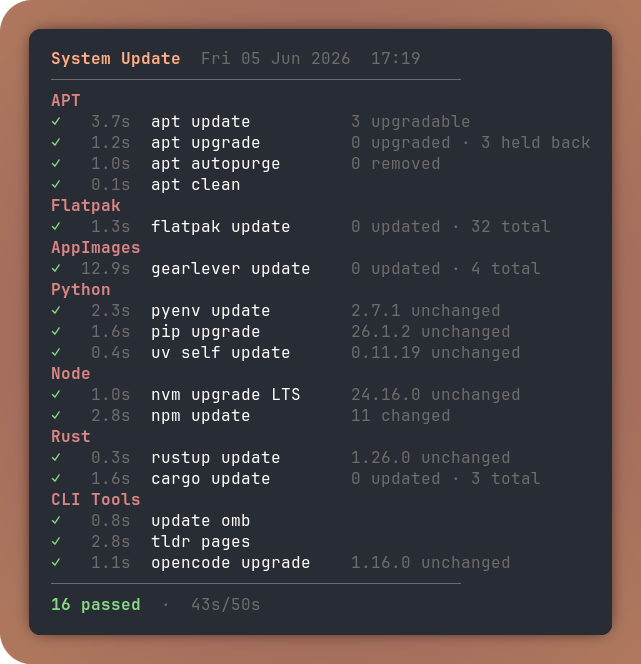
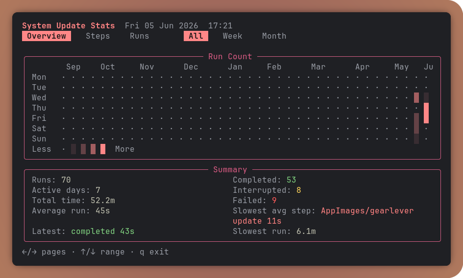

# Linux Update Manager

<p align="center">
  
</p>

Config-driven Linux update manager with a compact terminal UI, retained command logs, run history, stats, dry runs, and schema-validated YAML configuration.

The update steps are defined in `~/.config/update.yaml`. Commands are trusted shell configuration, so keep the config owned by your user and not group/world-writable.

## Features

- Run package manager and tool updates from one ordered YAML config.
- Skip steps when dependencies are missing or `skip_if` checks match.
- Capture retained per-command logs under `~/.update/logs`.
- Store run history under `~/.update/history.jsonl` for estimates and stats.
- Show before/after stats from command output using `$UPDATE_TMPDIR`.
- Support dry runs, readiness checks, exact step filters, and section filters.
- Provide a JSON Schema for editor validation and completion.

## Requirements

- Python 3.10 or newer.
- Runtime Python packages: `PyYAML` and `rich`.
- Optional stats dashboard package: `textual`.

Install the Python dependencies with your preferred tool, for example:

```sh
python3 -m pip install -r requirements.txt
```

## Install

```sh
install -m 755 update ~/.local/bin/update
mkdir -p ~/.config
cp examples/update.yaml ~/.config/update.yaml
```

Edit `~/.config/update.yaml` for your system before running real updates.

## Usage

```sh
update                    # run selected update steps
update -n                 # dry run
update -c                 # readiness check
update -s                 # stats
update --self-test        # internal helper tests
update --only "apt update"
update --skip "cargo update"
update --section APT
```

## Config

The example config is in `examples/update.yaml`. The schema is in `schema/update.schema.json` and is linked from the example with:

```yaml
# yaml-language-server: $schema=../schema/update.schema.json
```

Step format:

```yaml
Section Name:
  step name:
    run: command to execute
    needs:
      - required-executable-or-path
    skip_if: shell condition that skips when it exits 0
    stat:
      after:
        changed: command that prints a number or short value
```

`run` can be a string or list of strings. `needs` can be omitted; the updater will infer command requirements from `run`.

`stat.version` is exclusive with `stat.before` and `stat.after`.

Use `$UPDATE_TMPDIR` for scratch output files that later stat commands parse during the same run.

## State

Persistent state is stored under `~/.update`:

```text
~/.update/history.jsonl
~/.update/logs/
~/.update/update.lock
```

The retained logs are useful when a step fails. `$UPDATE_TMPDIR` is different: it is private per-run scratch space and is removed after the run.

## Security

This tool intentionally runs configured commands through a shell. Treat `update.yaml` as executable code.

The script rejects configs not owned by the current user or writable by group/others.
